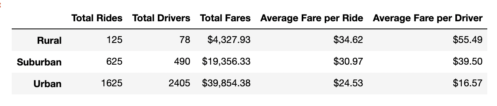
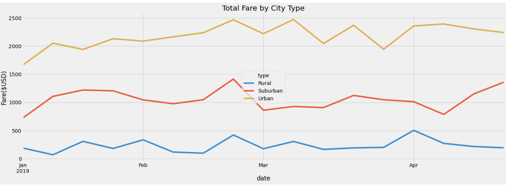

# PyBer Analysis
## Overview

### Purpose

We analyzed data for PyBer that's a ride-sharing company operates in rural, suburban, and urban areas. Our goal was to find out the connection between 
the number of rides, drivers and fare averages.

### Results
As we can see in the table below that as the number of rides increase, average $ per ride goes down. Rural areas have the smallest number of rides and drivers but it brings the highest amount of fare per ride and per driver. In contrast, that's not the case for urban areas. That can be explained with demand-supply balance. In rural areas there are 78 drivers and 125 rides requested. That's 1.6 ride per driver. In suburban areas there are 490 drivers and 625 rides, 1.3 rides per driver. In urban areas, there are 2405 drivers but only 1625 rides. 0.7 ride per driver. Clearly, competition in urban areas brought average per ride and per driver amounts down.

## Summary
- The graphic below visualizes that in all three areas company is doing well from mid-Feb to early March. That can be analyzed further to find out the reason of the increase. 
- There is more drivers than demanded rides in urban areas. That's bringing average fare per driver down significantly. That can be looked at closely to figure out if less drivers on the roads would mean higher income for the company and the drivers.
- Company can also look into hiring more drivers in suburban areas and rural areas. Perhaps, some urban drivers can be directed toward those areas if feasible.

